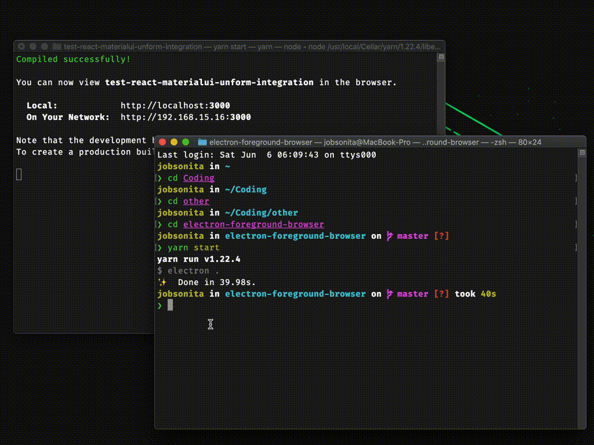

<p align="center"></p>

### Instructions

You can use either [NPM](https://nodejs.org/en/download/package-manager/) or [Yarn](https://yarnpkg.com/en/docs/install/) to manage the package installation. I use yarn in the instructions below.

Clone the project and install the packages.

```
git clone https://github.com/jobsonita/electron-foreground-browser.git
cd electron-foreground-browser
yarn
```

Create a copy of `.env.example` named `.env` and modify its contents with your desired settings.

`.env.example` contents
```
URL = https://www.google.com
WIDTH = 1024
HEIGHT = 768
```

Run the application from the project root:

```
yarn start
```

### References/Credits

This project was based on [simple-webview](https://github.com/maykbrito/simple-webview) project by user [maykbrito](https://github.com/maykbrito) and on [his video](https://youtube.com/watch?v=zy-B9d2ZVrw) in which he describes how to create such application.
